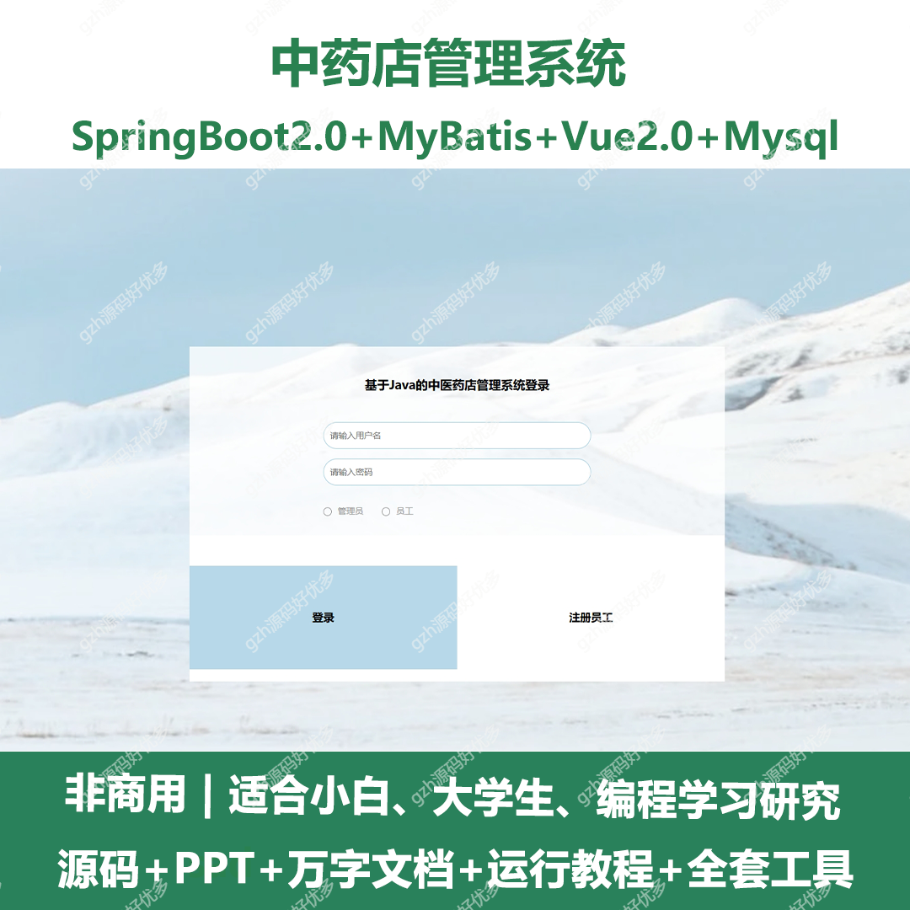
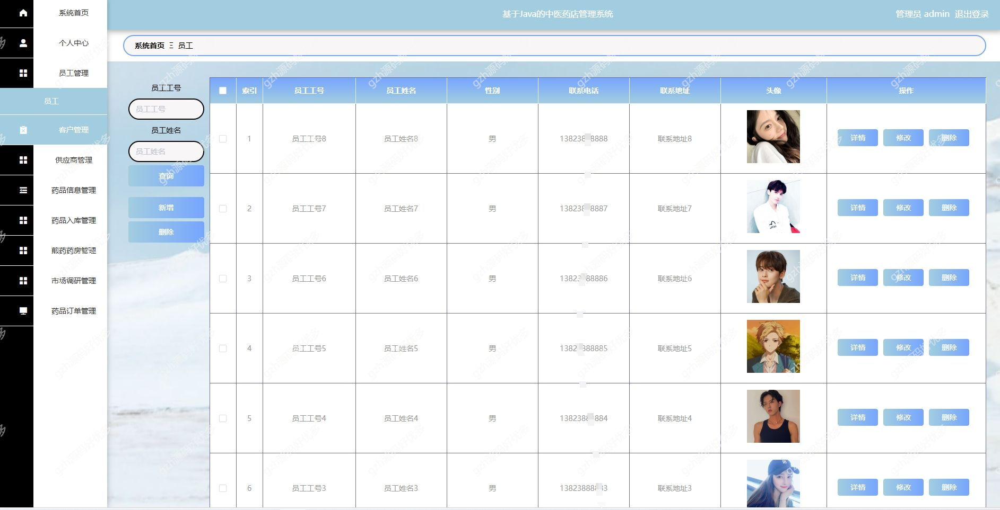
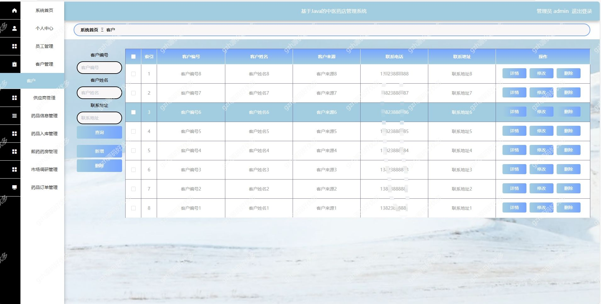
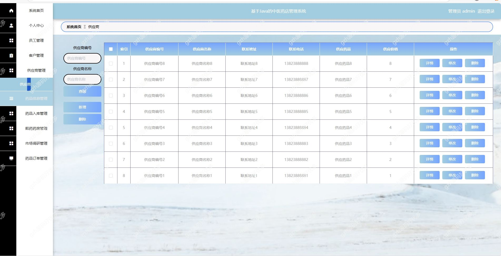
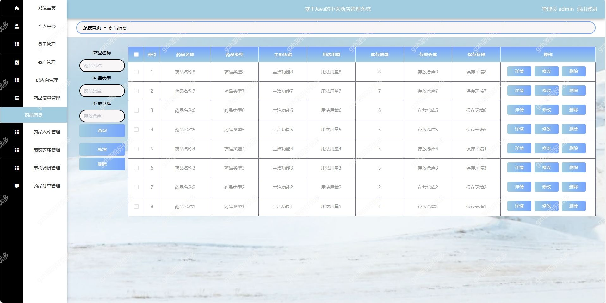
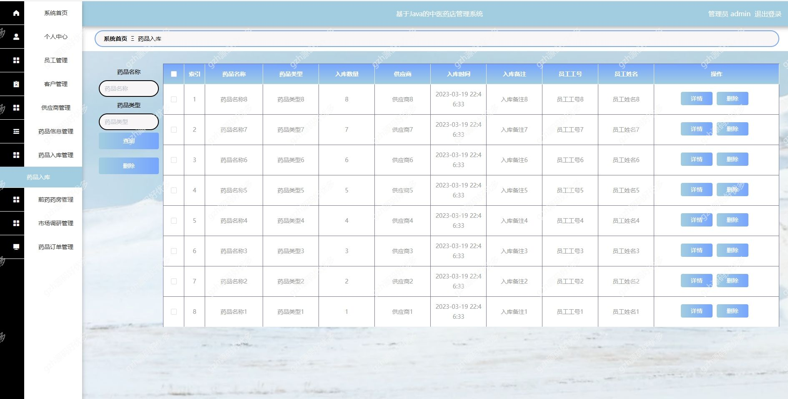
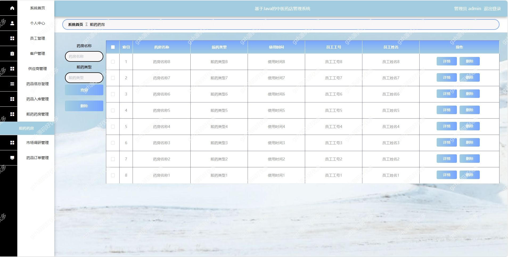
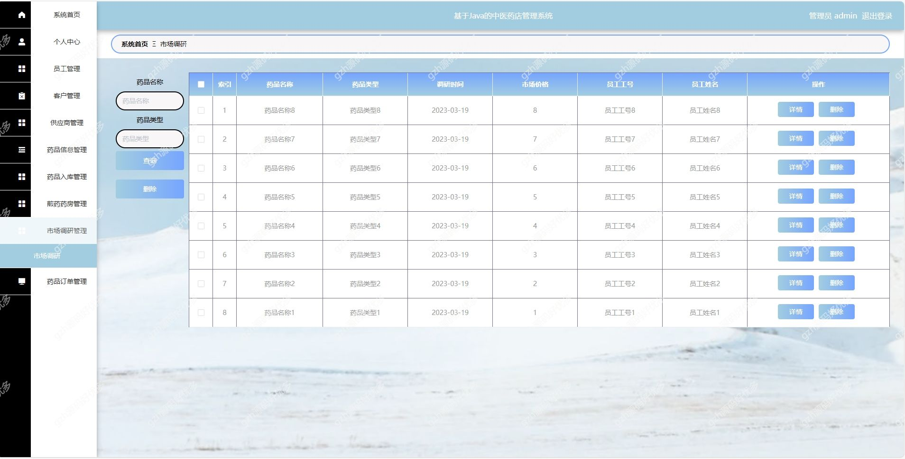
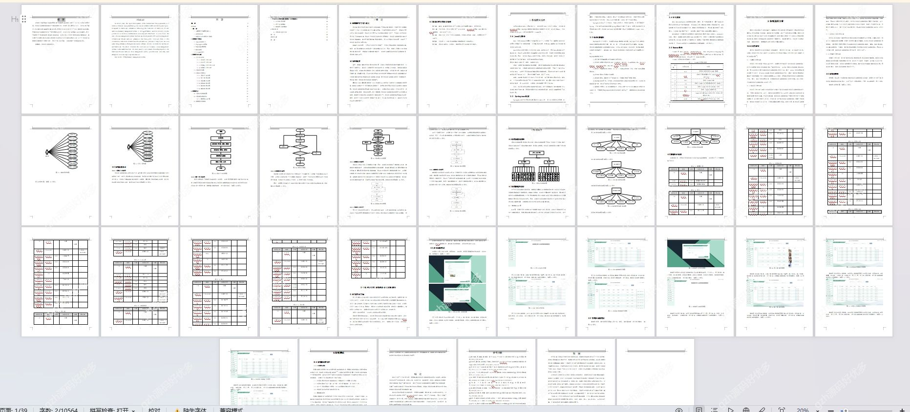

# springbootA302
springbootA302中医药店管理系统
 
## 查看主页获取源码

### 一、关键词
中医药店管理系统，中医药店系统

### 二、作品包含
源码+数据库+万字设计文档+PPT+全套环境和工具资源+本地部署教程

### 三、项目技术
前端技术：Vue2.0、Element + Axios、Vue Router
后端技术：Java、SpringBoot2.0、MyBatis

### 四、运行环境（以下版本亲测，其他版本兼容性请自行测试）
开发工具：IDEA/eclipse  + VSCODE

数据库：MySQL5.7

数据库管理工具：Navicat10以上版本

环境配置软件： JDK1.8 + Maven3.6.3

前端Nodejs：14

浏览器：谷歌浏览器

### 五、项目介绍
项目编号：springbootA302

随着经济的发展，人民的生活水平也提高了，于是对网络的需求也越来越依赖。然而，线下管理模式的改进却是一项比较繁杂的工作，因此，管理人员要充分发挥信息化管理的作用，提高本行业整体管理能力，并改进完善现有的中医药店管理体系，是非常有意义的

中医药店管理系统分管理员与员工模块，均具备系统首页、个人中心、客户管理、供应商管理、药品信息 / 入库 / 煎药房管理、市场调研及药品订单管理功能 ，管理员额外可进行员工管理 。
### 六、运行截图

